# Logistic map: from one orbit to the period-doubling route to chaos

This tutorial uses the [Fork web application](https://forkdynamics.com). It starts with the default **LogisticMap** system. You do not need prior knowledge of dynamical systems or Fork.

The logistic map updates one number. The next value depends on the present value:

$$
x_{n+1}=r x_n(1-x_n).
$$

Here, **x** is the state variable. It is the number that changes. The symbol **n** is the update number. The parameter **r** controls the behavior. For more background, refer to the [logistic map article](https://en.wikipedia.org/wiki/Logistic_map).

## Objectives

When you complete this tutorial, you will be able to:

- identify the main parts of the Fork window;
- inspect a system equation and its default parameter;
- calculate and show an orbit;
- calculate a stable fixed point at a custom parameter value;
- create a bifurcation diagram;
- continue cycles with periods 1, 2, 4, 8, 16, and 32;
- give each branch a different color;
- relate the branch points to the first Feigenbaum constant.

The final diagram has a sequence of fork-like splits. The splits have a pitchfork shape in the diagram. Fork labels each split **Period Doubling** because a stable cycle changes into a cycle with twice as many values. This process is the **period-doubling route to chaos**.

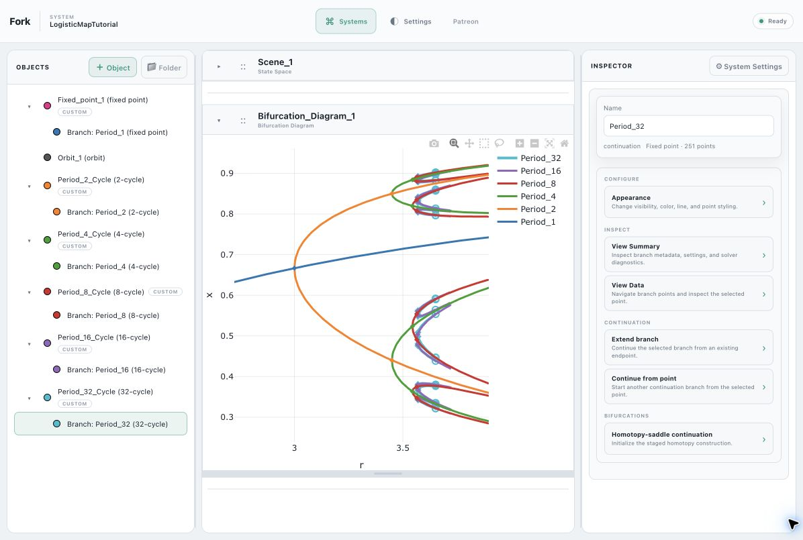

## 1. Open the default logistic map

1. Open [forkdynamics.com](https://forkdynamics.com).

2. Click **Systems**.
3. Under **Open Existing**, click **LogisticMap**.
4. Close the **Systems** window.

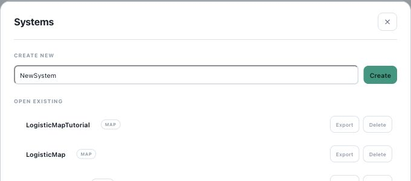

Fork has three main work areas:

- **Objects** is on the left. It contains calculated data, such as orbits, fixed points, cycles, and branches.
- The viewport area is in the center. It contains plots.
- **Inspector** is on the right. It contains settings and actions for the selected item.

The system name and the main menus are at the top.

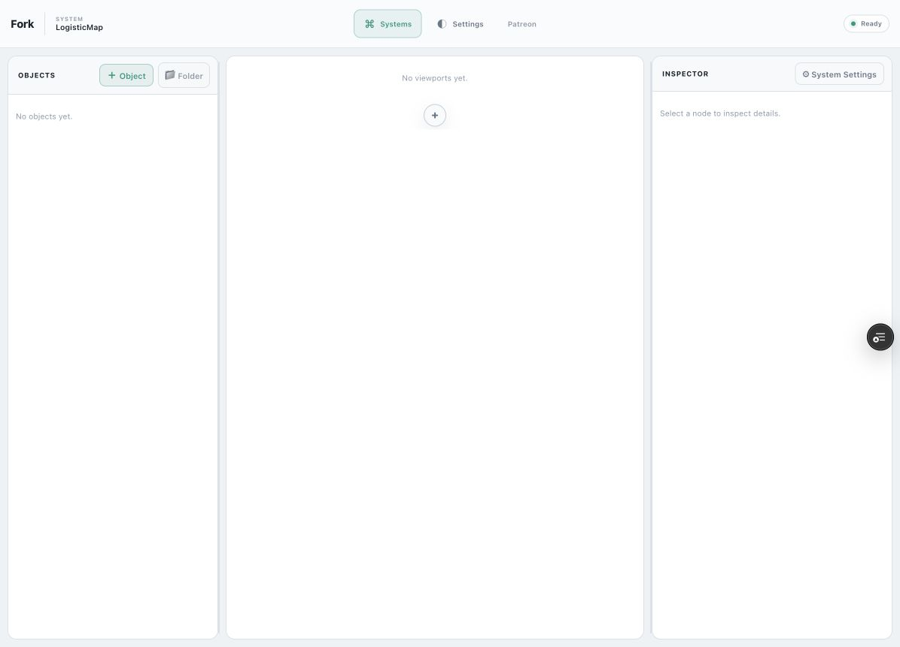

## 2. Inspect the equation and the default parameter

1. Click **System Settings** in the Inspector.
2. Find **System Type**. Confirm that **Discrete map** is selected.
3. Find **Variables and equations**. Confirm that the variable is **x**.
4. Confirm that the next-state expression is `r * x * (1 - x)`.
5. Find **Parameters**. Confirm that **r** has the value **3.9**.
6. Close the **System settings** window. Do not change a value.

A discrete map applies its equation one time for each update. An **orbit** is the list of values that these updates produce.

## 3. Calculate an orbit at the default parameter value

1. Click **Object** in the Objects area.
2. Click **Orbit**.

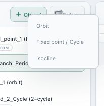

Fork adds **Orbit_1** to Objects. The Inspector now contains the commands for the orbit.

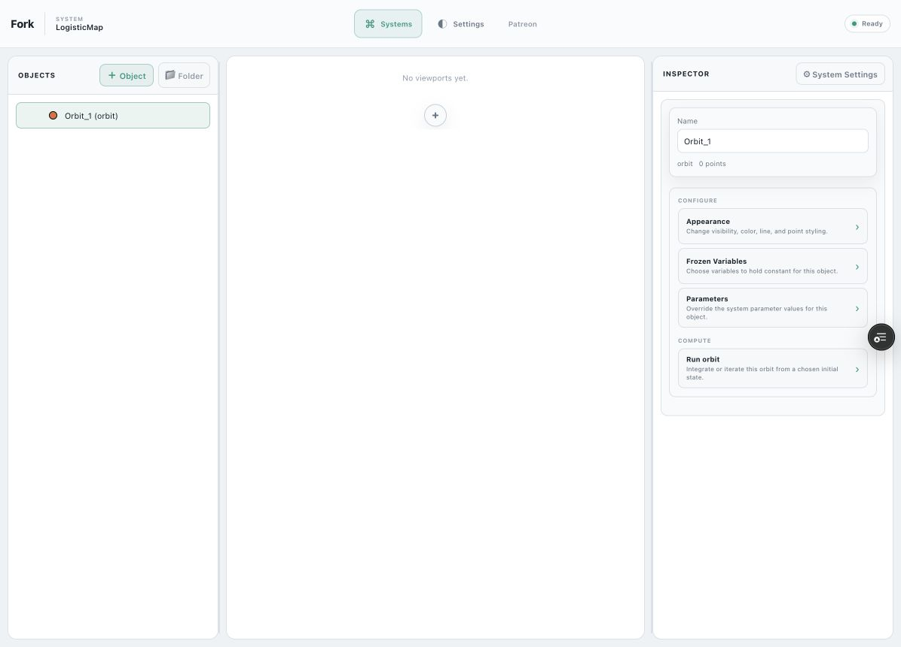

3. Click **Run orbit** in the Inspector.

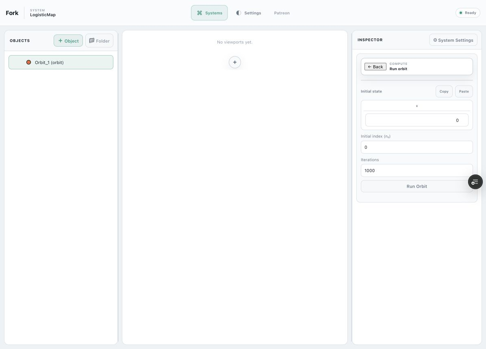

4. Set the initial value of **x** to **0.2**.
5. Keep **Initial index** at **0**.
6. Set **Iterations** to **200**.

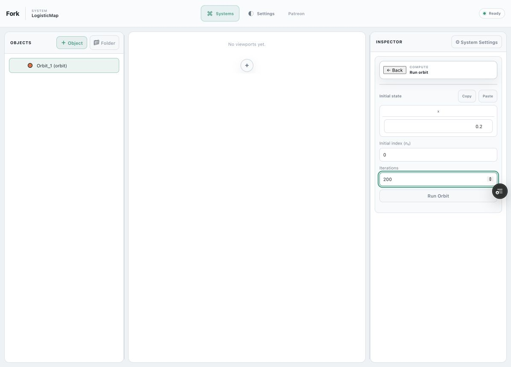

7. Click **Run Orbit**.

Fork calculates 201 points. The first point has index 0. The next 200 points come from the 200 updates.

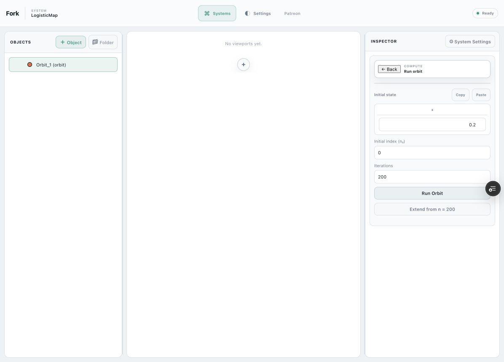

## 4. Show the orbit in a State Space Scene

1. Click the **+** button in the center viewport area.
2. Click **State Space Scene**.

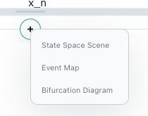

The horizontal axis is the present value, **x_n**. The vertical axis is the next value, **x_{n+1}**. The connected horizontal and vertical lines show how one update leads to the next update.

At the default value **r = 3.9**, the orbit does not settle on one value or on a short repeating cycle. This irregular motion is chaotic behavior.

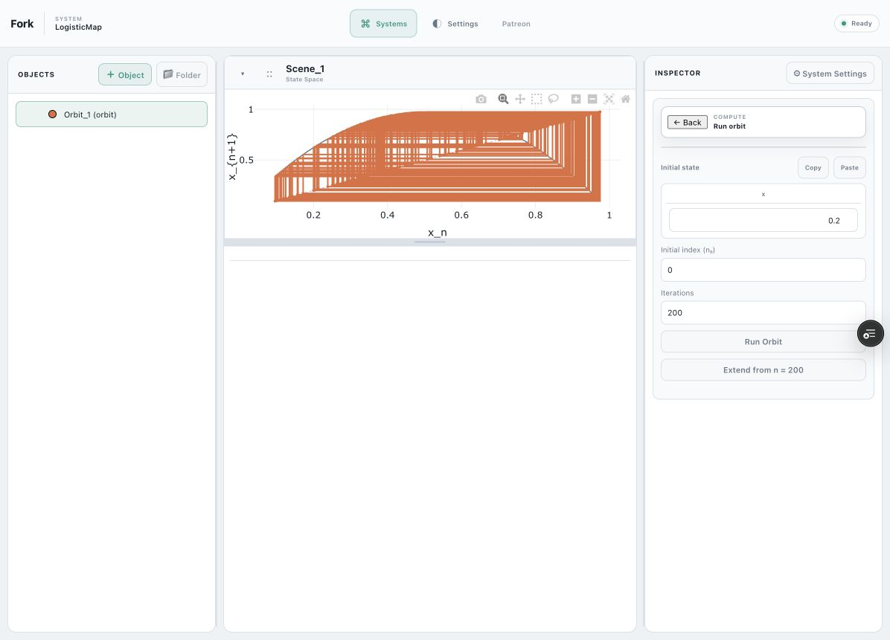

## 5. Calculate a stable fixed point at r = 2

A **fixed point** is a value that one update does not change. For this map at **r = 2**, the equation for a fixed point is:

$$
x=2x(1-x).
$$

The fixed points are 0 and 0.5. The point at 0.5 is stable. A nearby orbit moves toward it. The point at 0 is unstable. This tutorial uses a guess near the one stable fixed point at 0.5.

1. Click **Object**.
2. Click **Fixed point / Cycle**.

Fork adds **Fixed_point_1** to Objects.

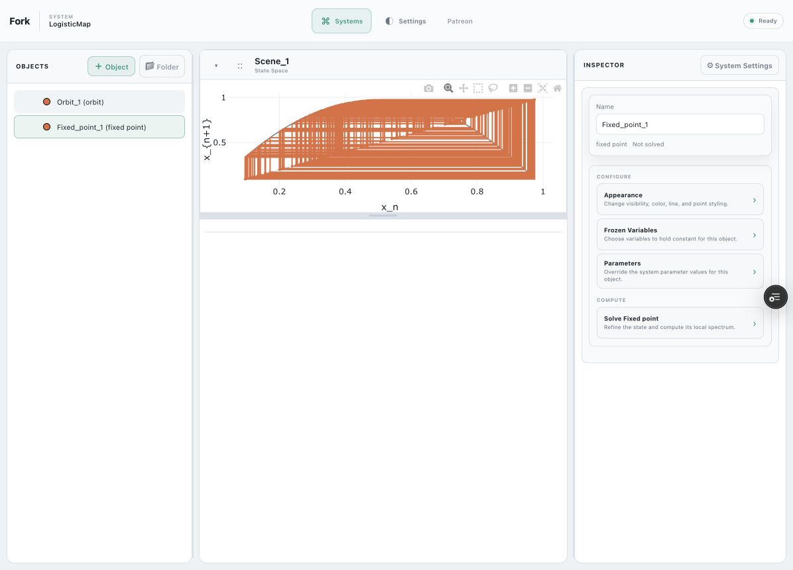

3. Click **Parameters** in the Inspector.
4. Set **r** to **2**.
5. Click **Back**.

The **custom** label means that this object does not use the system default value of **r**.

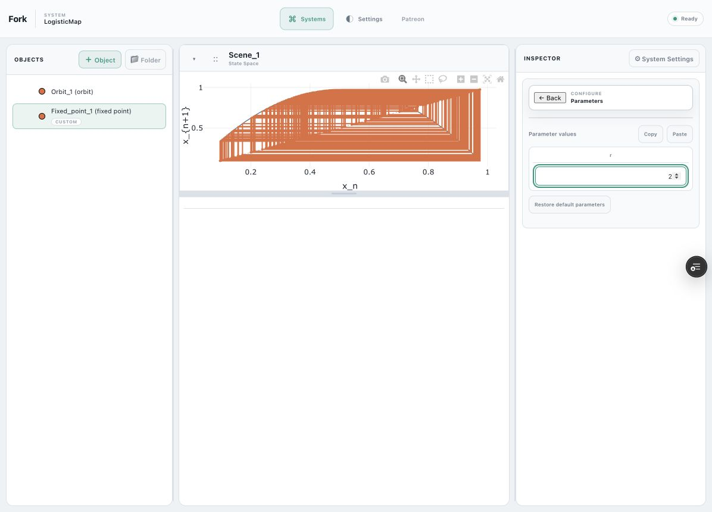

6. Click **Solve Fixed point**.
7. Set the initial value of **x** to **0.5**.
8. Keep **Max steps** at **25**.
9. Keep **Damping** at **1**.
10. Keep **Cycle length** at **1**.
11. Click **Solve Fixed point**.

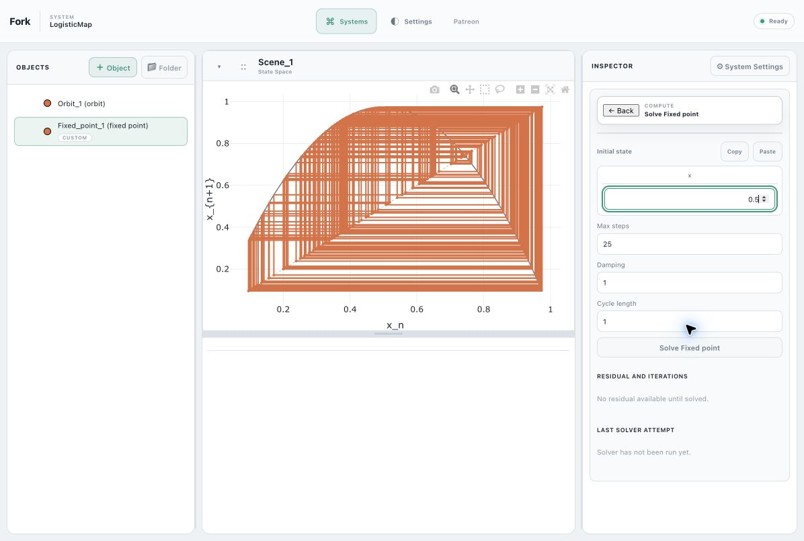

The result is **Success**. The residual is 0. A residual near 0 means that the calculated value satisfies the fixed-point equation.

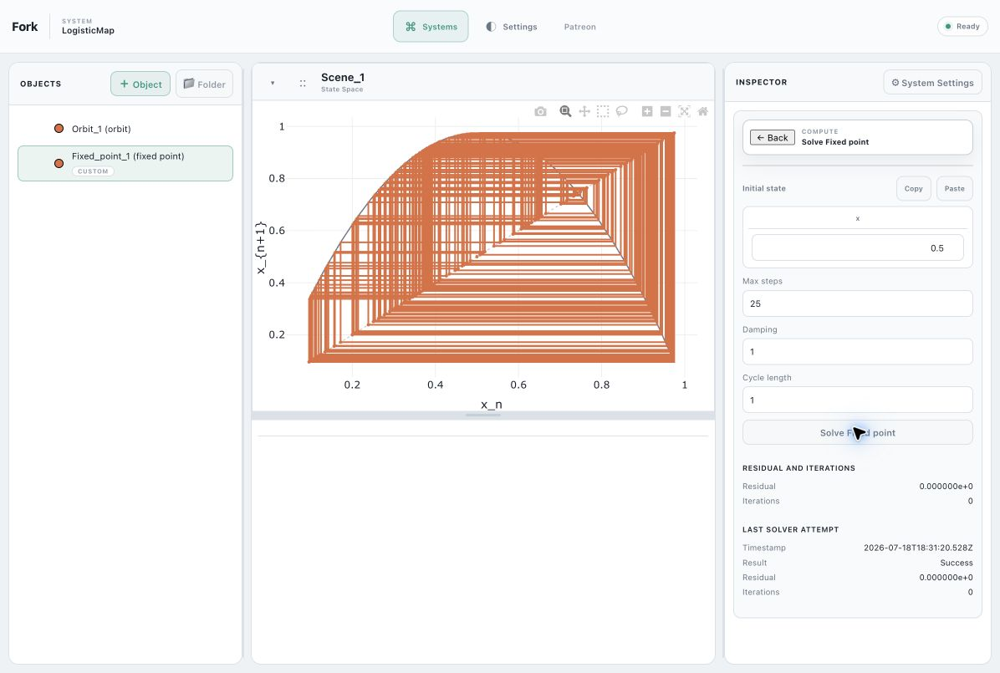

12. Click **Back**.
13. Click **View Data**.

Confirm these results:

- **x = 0.500000**;
- **r = 2.00000**;
- the multiplier is 0.

For a one-variable map, a fixed point is stable when the absolute value of its multiplier is less than 1. The multiplier here is 0, so the point is stable.

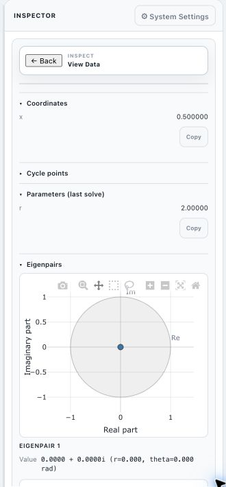

## 6. Put the fixed point on top and change the object colors

The order in Objects controls the draw order. The first object is drawn on top of objects below it.

1. Drag **Fixed_point_1** above **Orbit_1**.
2. Select **Fixed_point_1**.
3. Click **Appearance**.
4. Click the **Color** box.
5. In the system color window, enter **#e7298a**.
6. Set **Point Size** to **10**.
7. Click **Back**.
8. Select **Orbit_1**.
9. Click **Appearance**.
10. Set its color to **#555555**.
11. Click **Back**.

The magenta fixed point is now above the gray orbit. This order makes the fixed point easier to see when the two objects use the same plot area.

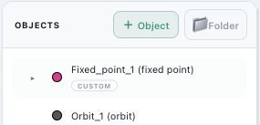

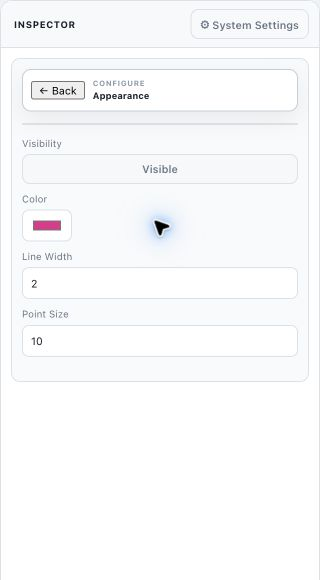

## 7. Create and prepare a bifurcation diagram

A **bifurcation** is a parameter value where the behavior changes. A **bifurcation diagram** shows the calculated state values against a parameter.

1. Click the **+** button below the State Space Scene.
2. Click **Bifurcation Diagram**.

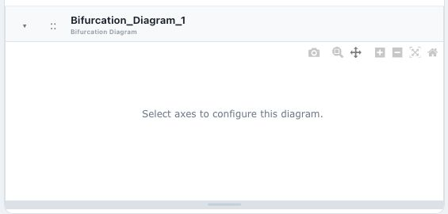

3. In the Inspector, set **Abscissa** to **Parameter: r**.
4. Set **Ordinate** to **State space variable: x**.

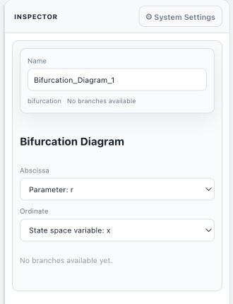

5. Collapse the State Space Scene.
6. Drag the resize handle below the bifurcation diagram down.
7. Stop when the diagram has nearly equal width and height.

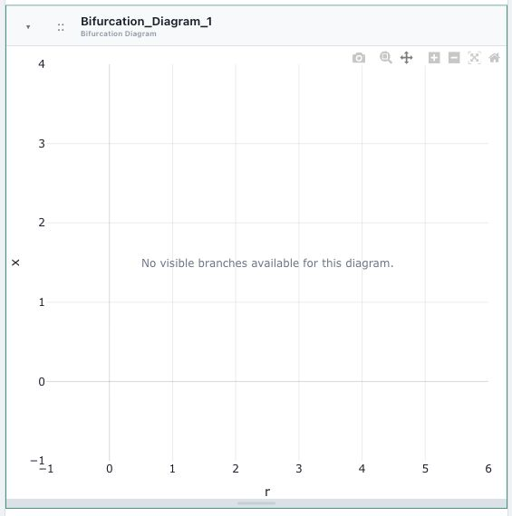

8. Click **Zoom** in the plot toolbar.
9. Drag across the plot from **r = 2.7** to **r = 3.9**.

Do this zoom before you add branches. It makes the period-doubling region easier to inspect.

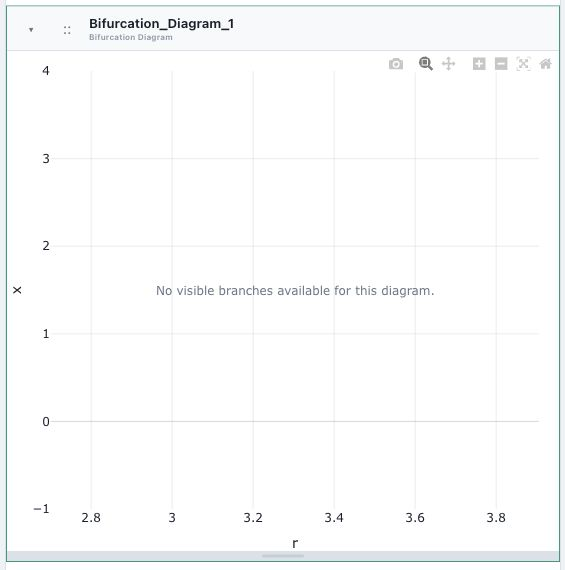

## 8. Continue the period-1 fixed point

Continuation follows a solution while the parameter changes. The result is a **branch**.

1. Select **Fixed_point_1** in Objects.
2. Click **Continue Fixed point**.
3. Use these values:

| Field | Value |
| --- | --- |
| Branch name | `Period_1` |
| Continuation parameter | `r` |
| Direction | `Forward (Increasing Param)` |
| Initial step size | `0.01` |
| Max points | `120` |
| Min step size | `1e-5` |
| Max step size | `0.02` |
| Corrector steps | `4` |
| Corrector tolerance | `1e-6` |
| Step tolerance | `1e-6` |

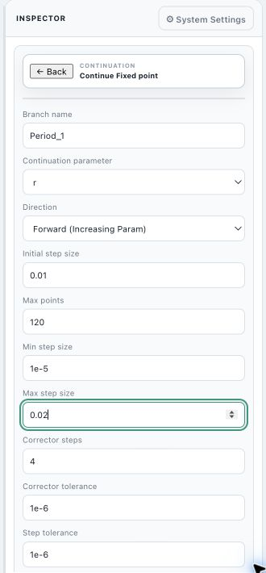

4. Click **Continue Fixed point**.
5. Select **Branch: Period_1** in Objects.
6. Click **Appearance**.
7. Set **Color** to **#1f77b4**.
8. Set **Line Width** to **3**.
9. Click **Back**.

Change the color before you inspect the new diagram. The screenshot below therefore shows the same blue color as the color setting.

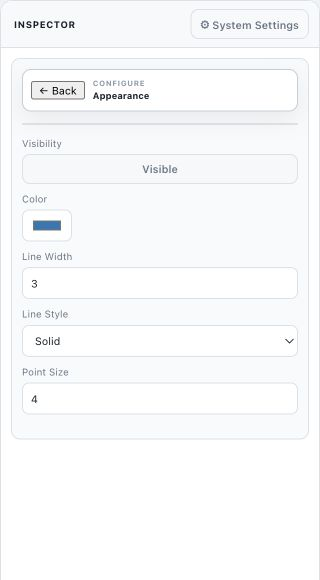

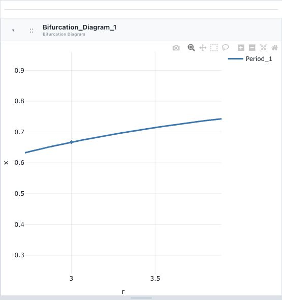

10. Click **View Data**.
11. Set **Point index** to **53**.
12. Click **Jump**.

Fork identifies **Index 53 - Period Doubling** at **r = 3.00000**. The multiplier is -1. This value marks the first period doubling.

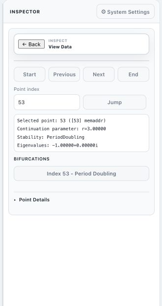

## 9. Create the doubled-period branches

At a period-doubling point, the stable cycle loses stability and a cycle with twice the period starts. **PD** means period doubling. Fork uses the command **Cycle from PD** to create that new cycle.

The perturbation amplitude is a small change that starts the new doubled cycle. The other solver fields control the numerical search. Use the values in the table.

Use this procedure for each new branch:

1. Select the source branch.
2. Click **View Data**.
3. Go to the period-doubling index in the table below.
4. Click the **Index ... - Period Doubling** item.
5. Click **Cycle from PD**.
6. Enter the cycle name, branch name, and continuation values.
7. Click **Continue Cycle**.
8. Select the new branch in Objects.
9. Click **Appearance**.
10. Set its color and set **Line Width** to **3**.
11. Click **Back**.
12. Confirm that the new branch has the correct color in the diagram.

For fields that are not in this table, keep the values that Fork supplies.

| New branch | Source branch | PD index | Cycle name | Amplitude | Max solver steps | Initial step | Max points | Min step | Max step | Corrector steps | Tolerances | Color |
| --- | --- | ---: | --- | ---: | ---: | ---: | ---: | ---: | ---: | ---: | --- | --- |
| Period 2 | `Period_1` | 53 | `Period_2_Cycle` | 0.01 | 25 | 0.005 | 120 | 1e-5 | 0.01 | 10 | 1e-6 | `#ff7f0e` |
| Period 4 | `Period_2` | 53 | `Period_4_Cycle` | 0.01 | 25 | 0.002 | 120 | 1e-5 | 0.005 | 10 | 1e-6 | `#2ca02c` |
| Period 8 | `Period_4` | 23 | `Period_8_Cycle` | 0.01 | 25 | 0.001 | 120 | 1e-5 | 0.003 | 10 | 1e-6 | `#d62728` |
| Period 16 | `Period_8` | 10 | `Period_16_Cycle` | 0.001 | 50 | 0.0002 | 160 | 1e-5 | 0.001 | 15 | 1e-6 | `#9467bd` |
| Period 32 | `Period_16` | 10 | `Period_32_Cycle` | 0.0002 | 75 | 0.0001 | 250 | 1e-6 | 0.0005 | 20 | 1e-8 | `#17becf` |

Use **r** as the continuation parameter. Use **Forward (Increasing Param)** as the direction. Keep the damping factor at **1**. The **Tolerances** column gives both the corrector tolerance and the step tolerance.

### Period 2

The first branch switch creates **Period_2_Cycle** and **Branch: Period_2**.

Change the new branch to orange before you continue.

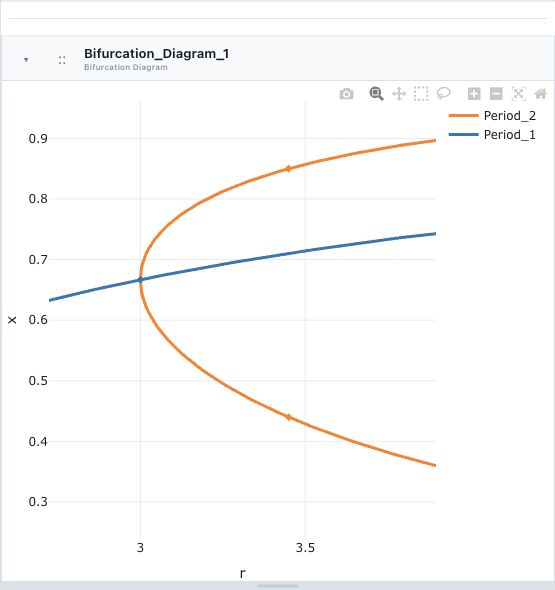

The next period doubling is at **index 53** and **r = 3.44949**.

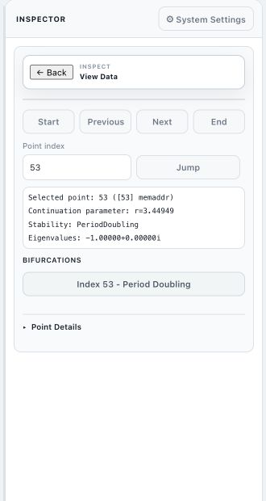

### Period 4

Create **Period_4_Cycle** and **Branch: Period_4** from the period-2 doubling point.

Change the new branch to green before you continue.

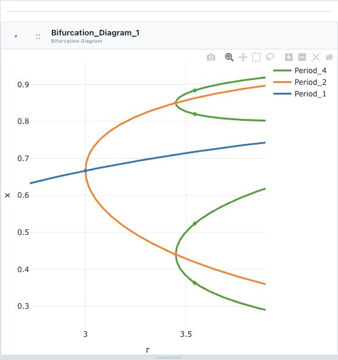

The next period doubling is at **index 23** and **r = 3.54409**.

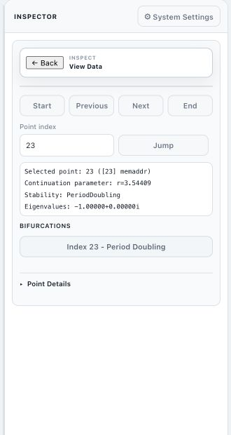

### Period 8

Create **Period_8_Cycle** and **Branch: Period_8** from the period-4 doubling point.

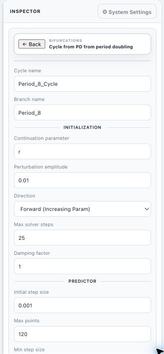

Change the new branch to red before you continue.

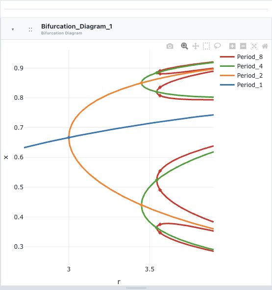

The next period doubling is at **index 10** and **r = 3.56441**.

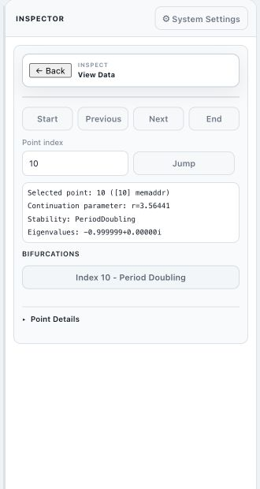

### Period 16

Create **Period_16_Cycle** and **Branch: Period_16** from the period-8 doubling point. Use the smaller amplitude and step values in the table. These values help Fork follow this short branch.

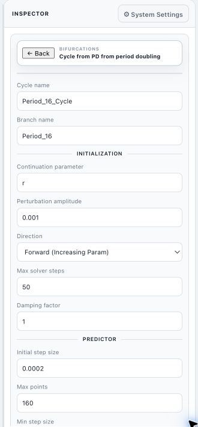

Change the new branch to purple before you continue.

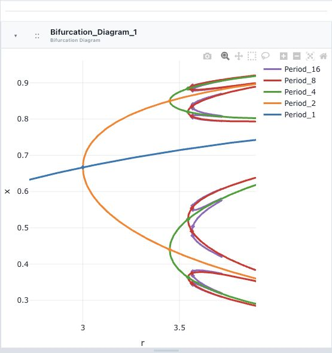

The next period doubling is at **index 10** and **r = 3.56876**.

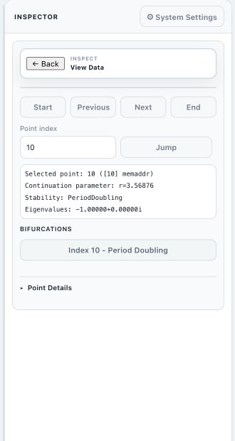

### Period 32

Create **Period_32_Cycle** and **Branch: Period_32** from the period-16 doubling point. Use the small values and the strict tolerances in the table.

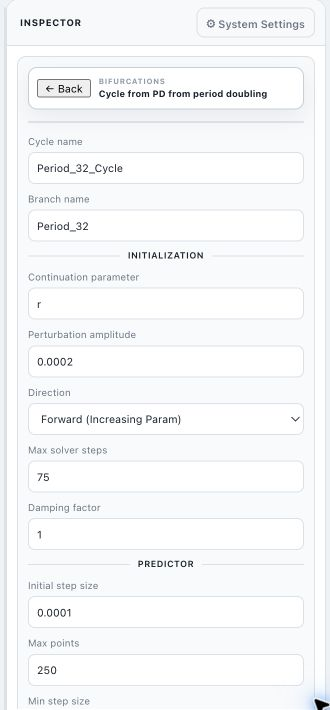

Change the new branch to cyan.

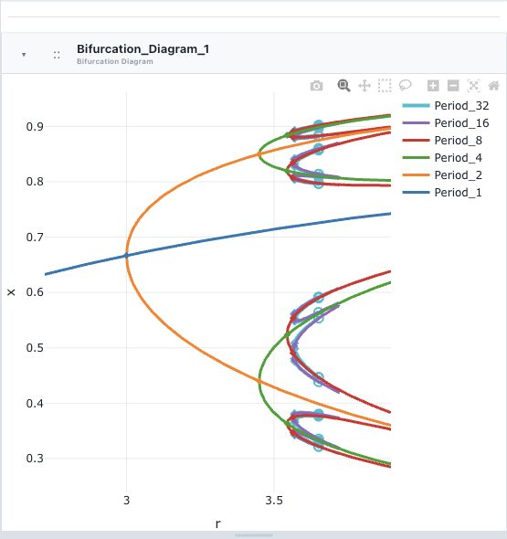

The period-32 branch has another period-doubling point at **index 6** and **r = 3.56969**. You do not need to create a period-64 branch in this tutorial.

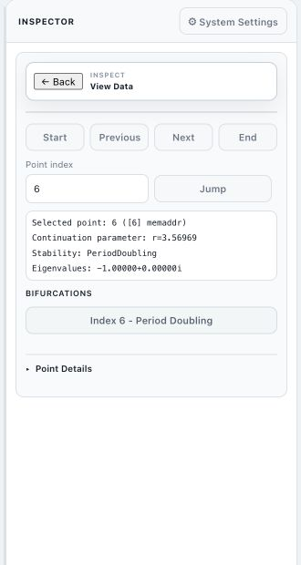

## 10. Change a branch color later

You can change a branch color at any time.

1. Select the branch in Objects.
2. Click **Appearance** in the Inspector.
3. Click the **Color** box.
4. Enter a new color in the system color window.
5. Close the system color window.
6. Set **Line Width** if you need a thicker line.
7. Click **Back**.
8. Confirm the new color in the diagram and in Objects.

Use a different color for each branch. The following color set has good separation:

| Object or branch | Color |
| --- | --- |
| Fixed point | Magenta `#e7298a` |
| Orbit | Dark gray `#555555` |
| Period 1 | Blue `#1f77b4` |
| Period 2 | Orange `#ff7f0e` |
| Period 4 | Green `#2ca02c` |
| Period 8 | Red `#d62728` |
| Period 16 | Purple `#9467bd` |
| Period 32 | Cyan `#17becf` |

The Objects list and the diagram legend must show the same colors.

## 11. Compare the branch points with the Feigenbaum constant

The period-doubling points become closer as the period increases.

| Doubling | Parameter value |
| --- | ---: |
| Period 1 to period 2 | 3.00000 |
| Period 2 to period 4 | 3.44949 |
| Period 4 to period 8 | 3.54409 |
| Period 8 to period 16 | 3.56441 |
| Period 16 to period 32 | 3.56876 |
| Period 32 to period 64 | 3.56969 |

Let the parameter values in this table be consecutive values of **r**. Divide one gap by the next gap:

$$
\delta_n=\frac{r_n-r_{n-1}}{r_{n+1}-r_n}.
$$

The ratios from the displayed Fork values are approximately:

| Ratio | Value |
| --- | ---: |
| First | 4.7515 |
| Second | 4.6555 |
| Third | 4.6713 |
| Fourth | 4.6774 |

These ratios approach approximately 4.669. This number is the first Feigenbaum constant. Refer to [The first Feigenbaum constant](https://en.wikipedia.org/wiki/Feigenbaum_constants#The_first_constant) for its definition and history.

Fork shows the parameter values to five decimal places in these screenshots. This display precision limits the accuracy of the last ratio.

The period doublings accumulate near **r = 3.56995**. The branch splits become too close to separate at the present scale. At larger values of **r**, the logistic map has chaotic regions. The orbit at **r = 3.9** in the first part of this tutorial is one example.

## Result

You used one simple update equation to make an orbit, calculate a stable fixed point, and follow the route from period 1 to period 32. The diagram shows how repeated period doublings lead toward chaos. The measured spacing also shows the approach to the Feigenbaum constant.
