# Rössler flow: from a stable equilibrium to four period doublings

> **Note:** This tutorial was written by GPT-5.6 Sol. It is intended to adhere to the ASD-STE100 Simplified Technical English writing standard.

This tutorial uses the [Fork web application](https://forkdynamics.com). It starts with the existing **Rossler** system. You do not need prior knowledge of dynamical systems or Fork.

The Rössler system is a **flow**. A flow changes continuously with time. It has three state variables, **x**, **y**, and **z**:

$$
\begin{aligned}
\dot{x} &= -y-z,\\
\dot{y} &= x+a y,\\
\dot{z} &= b+z(x-c).
\end{aligned}
$$

The state variables give one moving point in three-dimensional state space. The parameters **a**, **b**, and **c** control the motion.

The overall purpose is to see how a stable repeating orbit changes as **a** increases. The orbit first starts at a Hopf bifurcation. It then goes through four period doublings. Each doubling makes the repeating sequence twice as long. This sequence is one route from simple motion toward complicated motion.

## Objectives

When you complete this tutorial, you will be able to:

- identify the main parts of the Fork window;
- calculate an orbit at the default parameter values;
- show the orbit in a three-dimensional State Space Scene;
- use Plotly turntable rotation;
- make an Event Map from local maxima of $-y(t)$;
- draw a cobweb in the Event Map;
- calculate a stable equilibrium;
- continue the equilibrium through a supercritical Hopf bifurcation;
- use **a** and **y** as the axes of a bifurcation diagram;
- continue stable limit cycles with periods 1, 2, 4, and 8;
- find four period-doubling bifurcations; and
- compare each calculated limit cycle with a matching orbit.

## Color and draw-order plan

Use the colors in this table. Each branch has a different color.

| Item | Color |
| --- | --- |
| Orbit | Dark gray `#555555` |
| Equilibrium object | Magenta `#e7298a` |
| Equilibrium branch | Blue `#1f77b4` |
| Period-1 branch | Purple `#9467bd` |
| Period-2 branch | Orange `#ff7f0e` |
| Period-4 branch | Green `#2ca02c` |
| Period-8 branch | Red `#d62728` |
| Limit-cycle object shown with an orbit | Rössler orange `#e06c3f` |

Change a color immediately after Fork creates the item:

1. Select the object or branch in **Objects**.
2. Click **Appearance** in the Inspector.
3. Click the **Color** box.
4. Enter the hexadecimal color in the system color window.
5. Close the system color window.
6. Set a branch **Line Width** to **3**.
7. Click **Back**.
8. Confirm that the color in Objects agrees with the color in the plot legend.

The first item in Objects is drawn on top of the items below it. Keep the active orbit above the active limit-cycle object. The dark orbit then shows its approach to the cycle. The orange cycle uses a thick line and large points, so it stays easy to identify.

## 1. Open the Rössler system

1. Open [forkdynamics.com](https://forkdynamics.com).
2. Click **Systems**.
3. Under **Open Existing**, click **Rossler**.
4. Close the **Systems** window.

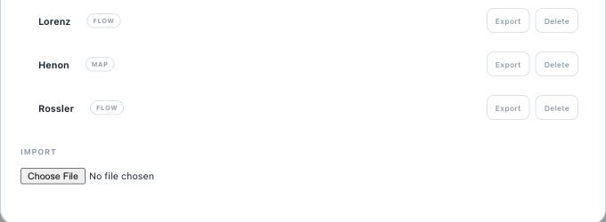

Fork now has three main work areas:

- **Objects** is on the left. It contains calculated orbits, equilibria, cycles, and branches.
- The viewport area is in the center. It contains plots.
- **Inspector** is on the right. It contains the settings and actions for the selected item.

The system name and the main menus are at the top.

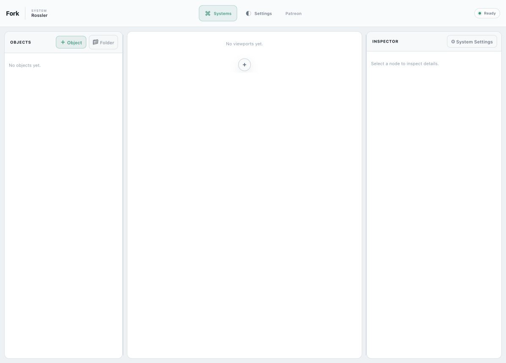

## 2. Inspect the system equations

1. Click **System Settings** in the Inspector.
2. Confirm that **Flow** is selected.
3. Confirm that the integrator is **rk4**.
4. Confirm the three equations shown at the start of this tutorial.
5. Confirm the default parameter values:

| Parameter | Value |
| --- | ---: |
| **a** | 0.2 |
| **b** | 0.2 |
| **c** | 5.7 |

6. Close the system settings. Do not change a value.

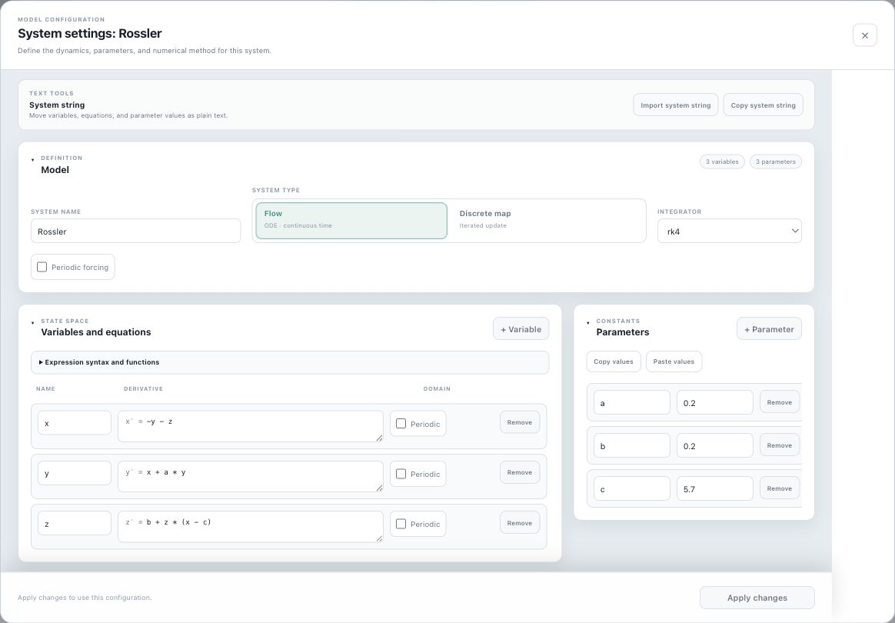

## 3. Calculate the default orbit

An **orbit** is the path of a state as time changes.

1. Click **Object** in Objects.
2. Click **Orbit**.

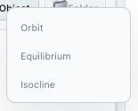

3. Rename the new object `Orbit_Default`.
4. Click **Appearance**.
5. Set **Color** to `#555555`.
6. Set **Line Width** to **2.5**.
7. Click **Back**.

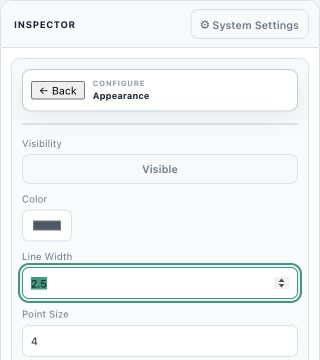

8. Click **Run orbit**.
9. Use these values:

| Field | Value |
| --- | --- |
| Initial **x** | 0.1 |
| Initial **y** | 0 |
| Initial **z** | 0 |
| Initial time | 0 |
| Duration | 300 |
| Step size | 0.01 |

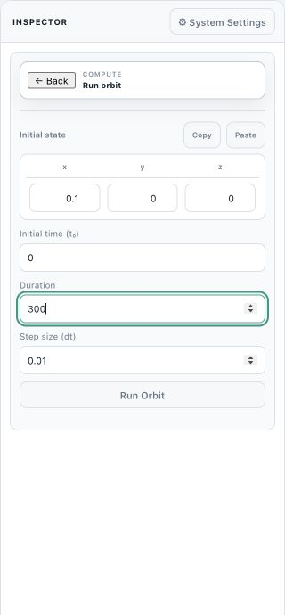

10. Click **Run Orbit**.

Fork calculates the motion at the default value **a = 0.2**.

## 4. Show and rotate the default orbit

1. Click the **+** button in the viewport area.
2. Click **State Space Scene**.

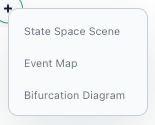

3. Rename the viewport `Scene_1`.
4. Confirm that the axes are **x**, **y**, and **z**.
5. Drag the viewport resize handle until the viewport has nearly equal width and height.
6. Move the pointer over the Plotly toolbar.
7. Click **Turntable rotation**.

8. Drag in the plot to rotate the view.
9. Stop when the tall arches and the flat spiral are both clear.

Turntable rotation keeps the vertical direction upright. This action makes it easier to compare different views of the same three-dimensional orbit.

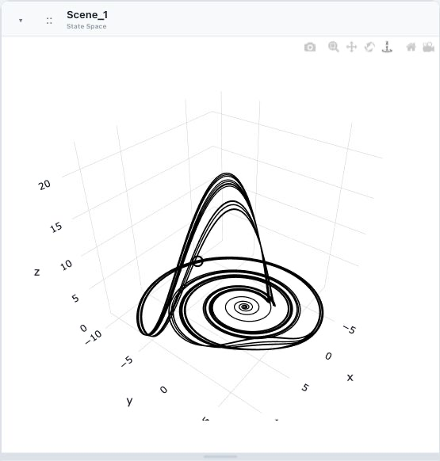

The orbit has many loops and does not settle on a short repeating path. This irregular long-term motion is the behavior that the period-doubling sequence approaches.

## 5. Make the Event Map

An **Event Map** samples an orbit only when a specified event occurs. This tutorial samples each local maximum of $-y(t)$.

A local maximum of $-y(t)$ is a local minimum of $y(t)$. At such a minimum, $\dot y$ changes from negative to positive. For this reason, use an upward crossing of the time derivative of **y**.

1. Click the **+** button below the State Space Scene.
2. Click **Event Map**.
3. Rename the viewport `Event_Map_Minus_y`.
4. In **Event**, use these values:

| Field | Value |
| --- | --- |
| Event mode | `Crossing up` |
| Source | `Time derivative (dx/dt)` |
| Variable | `y` |
| Event level | 0 |

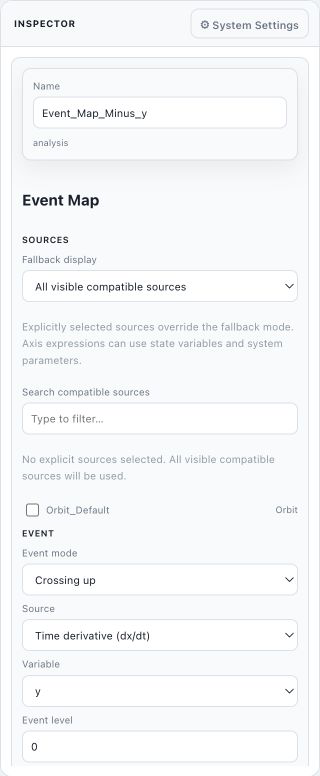

5. In **X axis**, use these values:

| Field | Value |
| --- | --- |
| Axis value | `Observable expression` |
| Label | `$-y_n$` |
| Expression | `-y` |
| Hit offset | 0 |

6. In **Y axis**, use these values:

| Field | Value |
| --- | --- |
| Axis value | `Observable expression` |
| Label | `$-y_{n+1}$` |
| Expression | `-y` |
| Hit offset | 1 |

7. Set **Z axis** to **Disabled**.
8. In **Advanced**, select **Show cobweb**.
9. Select **Show identity line**.
10. Set **Identity line style** to **Dotted**.
11. Resize the Event Map until it has nearly equal width and height.

The diagonal dotted line is the identity line. A cobweb segment goes from one sampled value to the next sampled value.

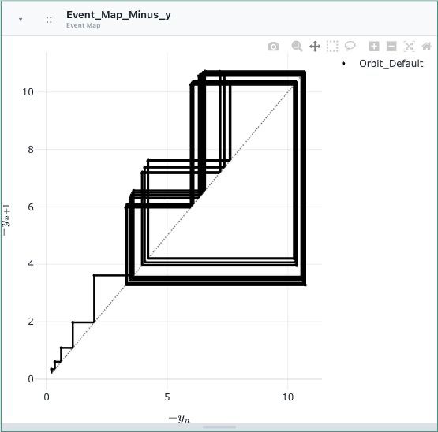

## 6. Calculate a stable equilibrium at a = 0

An **equilibrium** is a state that does not move. All three time derivatives are zero at an equilibrium.

1. Click **Object**.
2. Click **Equilibrium**.
3. Rename the new object `Stable_Equilibrium`.
4. Click **Appearance**.
5. Set **Color** to `#e7298a`.
6. Set **Point Size** to **10**.
7. Click **Back**.

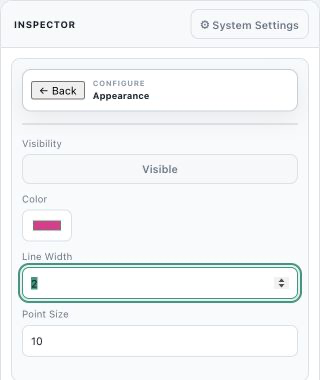

8. Click **Parameters**.
9. Set **a** to **0**.
10. Keep **b = 0.2** and **c = 5.7**.
11. Click **Back**.

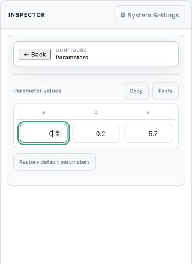

12. Click **Solve Equilibrium**.
13. Use this initial state:

| State variable | Initial value |
| --- | ---: |
| **x** | 0 |
| **y** | -0.035 |
| **z** | 0.035 |

14. Keep **Max steps** at **25**.
15. Keep **Damping** at **1**.

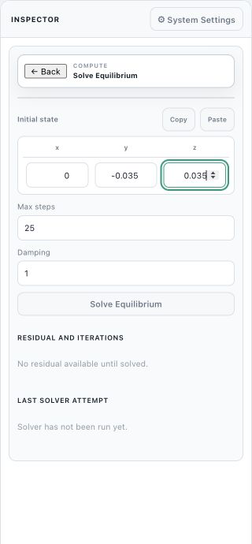

16. Click **Solve Equilibrium**.

The result is **Success**. The residual is approximately $2.8\times10^{-17}$. A residual near zero means that the calculated state satisfies the equilibrium equations.

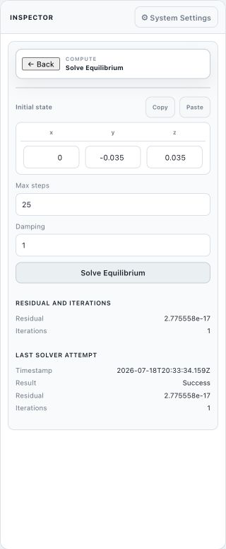

17. Click **Back**.
18. Click **View Data**.
19. Open **Coordinates**, **Parameters**, and **Eigenpairs**.

The calculated equilibrium is approximately

$$
(x,y,z)=(0,-0.0350877,0.0350877).
$$

The eigenvalues are approximately

$$
-0.0030\pm1.0005i,\qquad -5.6940.
$$

All real parts are negative. Thus, nearby states move toward the equilibrium. The equilibrium is stable.

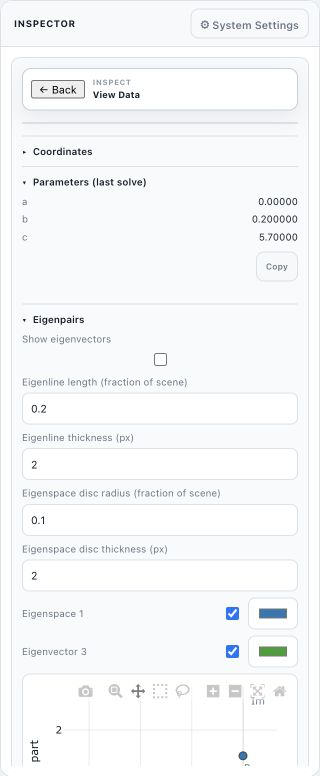

## 7. Create the bifurcation diagram

A **bifurcation** is a parameter value where the behavior changes. A **bifurcation diagram** shows calculated states against a parameter.

1. Click the **+** button below the Event Map.
2. Click **Bifurcation Diagram**.
3. Rename the viewport `Bifurcation_a_vs_y`.
4. Set **Abscissa** to **Parameter: a**.
5. Set **Ordinate** to **State space variable: y**.

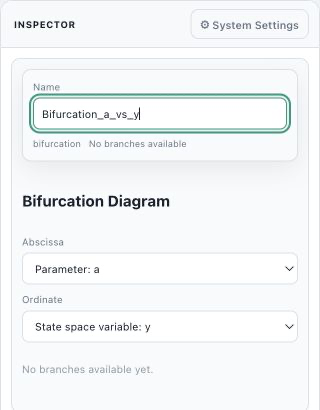

6. Collapse the State Space Scene and the Event Map.
7. Resize the bifurcation diagram until it has nearly equal width and height.

The diagram is empty because you have not made a continuation branch.

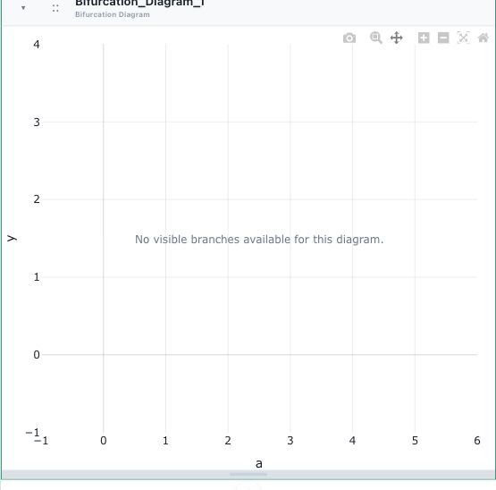

## 8. Continue the equilibrium to the Hopf bifurcation

**Continuation** follows a solution while one parameter changes. The result is a **branch**.

1. Select `Stable_Equilibrium` in Objects.
2. Click **Continue Equilibrium**.
3. Use these values:

| Field | Value |
| --- | --- |
| Branch name | `Equilibrium_a` |
| Continuation parameter | `a` |
| Direction | `Forward (Increasing Param)` |
| Initial step size | 0.002 |
| Max points | 60 |
| Min step size | 1e-5 |
| Max step size | 0.005 |
| Corrector steps | 4 |
| Corrector tolerance | 1e-6 |
| Step tolerance | 1e-6 |

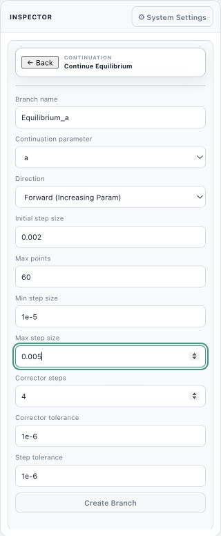

4. Click **Create Branch**.
5. Immediately select **Branch: Equilibrium_a**.
6. Click **Appearance**.
7. Set **Color** to `#1f77b4`.
8. Set **Line Width** to **3**.
9. Click **Back**.

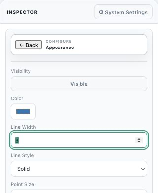

10. Click **View Data**.
11. Set **Point index** to **3**.
12. Click **Jump**.
13. Click **Index 3 - Hopf**.

Fork identifies a Hopf bifurcation at

$$
a=0.00597844.
$$

The conjugate eigenvalue pair is on the imaginary axis. The equilibrium changes stability at this point.

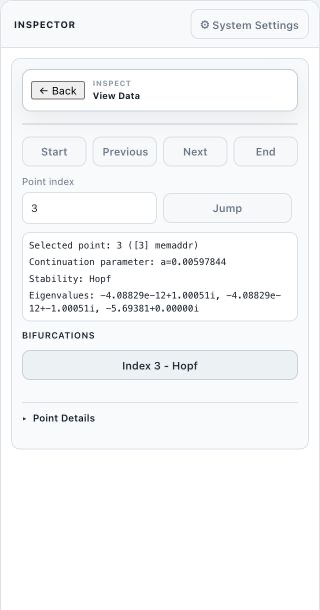

This Hopf bifurcation is **supercritical**. A stable, small limit cycle exists on the side where the equilibrium is unstable. The next section starts that cycle and confirms its stable branch.

## 9. Continue the period-1 limit cycle

A **limit cycle** is a closed orbit that repeats after one period.

1. With the Hopf point selected, click **Back**.
2. Click **Limit cycle from Hopf**.
3. Use these values:

| Field | Value |
| --- | --- |
| Limit cycle name | `Period_1_Cycle` |
| Branch name | `Period_1` |
| Continuation parameter | `a` |
| Initial amplitude | 0.1 |
| NTST | 20 |
| NCOL | 4 |
| Direction | `Forward (Increasing Param)` |
| Initial step size | 0.01 |
| Max points | 80 |
| Min step size | 1e-5 |
| Max step size | 0.02 |
| Corrector steps | 10 |
| Corrector tolerance | 1e-6 |
| Step tolerance | 1e-6 |

NTST is the number of mesh intervals along the cycle. NCOL is the number of collocation points in each interval.

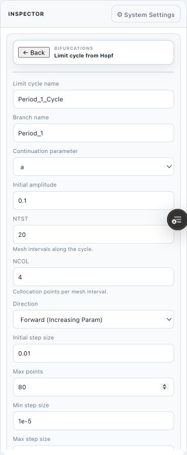

4. Click **Continue Limit Cycle**.
5. Immediately select `Period_1_Cycle`.
6. Click **Appearance**.
7. Set **Color** to `#e06c3f`.
8. Set **Line Width** to **4** and **Point Size** to **12**.
9. Click **Back**.
10. Select **Branch: Period_1**.
11. Click **Appearance**.
12. Set **Color** to `#9467bd`.
13. Set **Line Width** to **3**.
14. Click **Back**.

The first calculation has 81 branch points. Extend the branch to reach its period doubling:

15. Select **Branch: Period_1**.
16. Click **Extend branch**.
17. Start from the end point.
18. Set **Initial step size** to **0.05**.
19. Set **Max points** to **168**.
20. Set **Max step size** to **0.1**.
21. Keep the corrector values at **10** and **1e-6**.
22. Start the extension.

The period-1 branch is stable from the Hopf point to the first period doubling. This stable outgoing branch confirms the supercritical type of the Hopf bifurcation.

23. Click **View Data**.
24. Go to **index 153**.
25. Click **Index 153 - Period Doubling**.

Fork finds the first period doubling at

$$
a=0.109639.
$$

The period is approximately **6.04813**. One Floquet multiplier is -1. A multiplier at -1 identifies a period doubling.

## 10. Use the repeatable branch-switch procedure

Use this procedure after each period doubling:

1. Select the source branch.
2. Click **View Data**.
3. Go to the period-doubling index in the table below.
4. Click the **Index ... - Period Doubling** item.
5. Click **Back**.
6. Click **Limit Cycle from PD from period doubling**.
7. Enter the new cycle name, branch name, and continuation values.
8. Click **Continue Limit Cycle**.
9. Immediately set the new cycle color to `#e06c3f`.
10. Set its **Line Width** to **4** and its **Point Size** to **12**.
11. Immediately set the new branch color from the table below.
12. Set the branch **Line Width** to **3**.

For fields that are not in this table, keep the values that Fork supplies.

| New branch | Source branch | Source PD index | Initial step | Max points | Max step | Branch color |
| --- | --- | ---: | ---: | ---: | ---: | --- |
| `Period_2` | `Period_1` | 153 | 0.01 | 120 | 0.05 | Orange `#ff7f0e` |
| `Period_4` | `Period_2` | 45 | 0.005 | 80 | 0.02 | Green `#2ca02c` |
| `Period_8` | `Period_4` | 37 | 0.005 | 20 | 0.1 | Red `#d62728` |

For all three branch switches, use these common values:

| Field | Value |
| --- | --- |
| Perturbation amplitude | 0.01 |
| Direction | `Forward (Increasing Param)` |
| Min step size | 1e-5 |
| Corrector steps | 10 |
| Corrector tolerance | 1e-6 |
| Step tolerance | 1e-6 |
| Adapt mesh after rejected corrections | Selected |
| Redistribute before adding mesh intervals | Selected |
| Defect tolerance | 0.025 |
| Max mesh adaptations | 3 |
| Max mesh intervals | 512 |

After each switch, add the new branch to `Bifurcation_a_vs_y`. Keep **a** on the horizontal axis and **y** on the vertical axis.

## 11. Compare the stable period-2 cycle with an orbit

1. Create `Period_2_Cycle` and **Branch: Period_2** from the first period doubling.

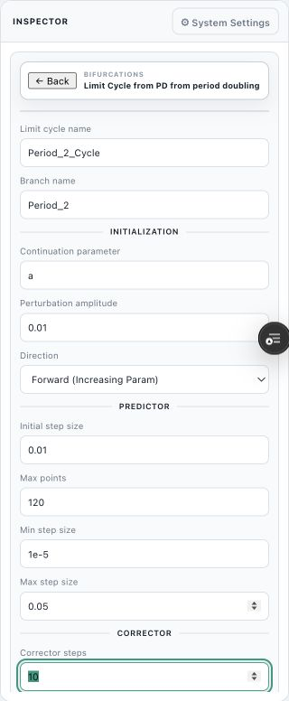

2. Apply the orange branch color immediately.
3. Select **Branch: Period_2** and click **View Data**.
4. Go to **index 40**.
5. Confirm that **Stability** is **stable**.
6. Confirm that **a = 0.136304**.
7. Click **Render LC Here**.

The rendered limit cycle has a period of approximately **12**.

8. Select `Period_2_Cycle`.
9. Click **View Data** and open **Data preview**.
10. Use row 0 as the initial state for the matching orbit:

$$
(x,y,z)=(4.8424,5.0837,3.5817).
$$

11. Rename `Orbit_Default` to `Orbit_Matched`.
12. Select `Orbit_Matched` and click **Parameters**.
13. Set **a** to **0.136304**.
14. Keep **b = 0.2** and **c = 5.7**.

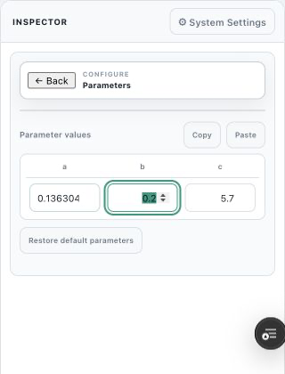

15. Click **Back**, and then click **Run orbit**.
16. Enter the initial state from row 0.
17. Set **Duration** to **200** and **Step size** to **0.01**.
18. Click **Run Orbit**.
19. Hide `Period_1_Cycle`. Keep its branch visible in the bifurcation diagram.
20. Keep `Orbit_Matched` before `Period_2_Cycle` in Objects.

The limit-cycle object uses a thick orange line and large orange points.

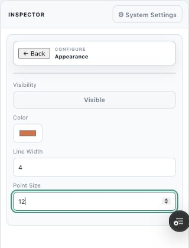

21. In `Scene_1`, explicitly select only `Orbit_Matched` and `Period_2_Cycle`.
22. Rotate the scene with **Turntable rotation**.

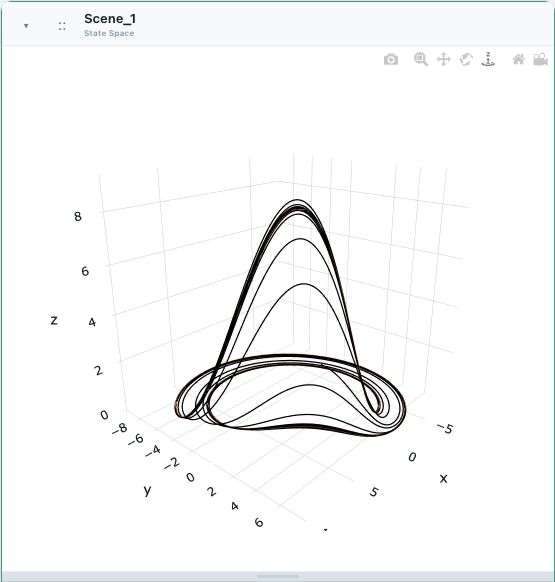

23. Expand `Event_Map_Minus_y`.
24. Confirm that **Show cobweb** is selected.

The orange limit-cycle point is on the diagonal. The dark orbit cobweb approaches it.

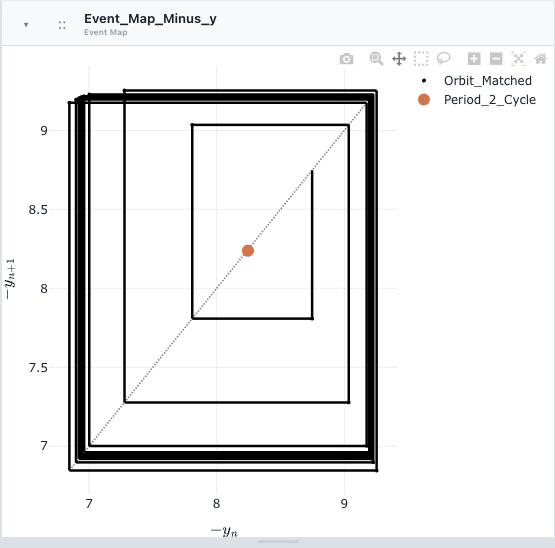

25. Return to **Branch: Period_2**.
26. Go to **index 45**.

Fork finds the second period doubling at

$$
a=0.142997.
$$

The period is approximately **11.9648**.

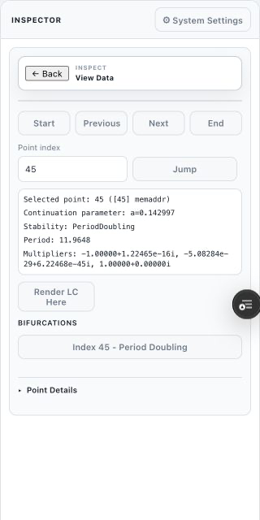

## 12. Compare the stable period-4 cycle with an orbit

1. Create `Period_4_Cycle` and **Branch: Period_4** from the second period doubling.

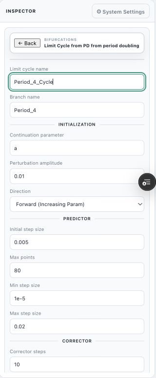

2. Apply the green branch color immediately.
3. Select **Branch: Period_4** and click **View Data**.
4. Go to **index 32**.
5. Confirm that **Stability** is **stable**.
6. Confirm that **a = 0.149853**.
7. Click **Render LC Here**.
8. Open the cycle **Data preview**.
9. Use row 0 as the initial state for `Orbit_Matched`:

$$
(x,y,z)=(4.4973,5.2440,0.9533).
$$

10. Set the orbit parameter **a** to **0.149853**.

11. Run the orbit for a duration of **200** with a step size of **0.01**.
12. Hide `Period_2_Cycle`.
13. Keep `Period_4_Cycle` visible.
14. In `Scene_1`, replace the period-2 cycle source with `Period_4_Cycle`.
15. Use **Turntable rotation** to make the loops clear.

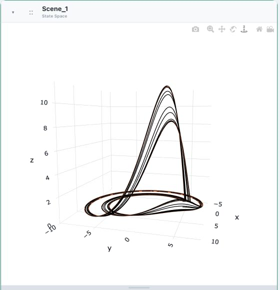

16. Expand `Event_Map_Minus_y`.

The period-4 cycle gives two orange return points for this event definition. The dark orbit cobweb approaches the same two-point return pattern.

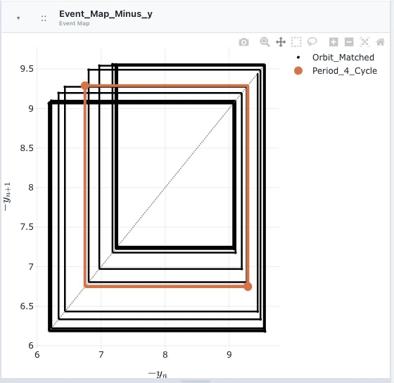

17. Return to **Branch: Period_4**.
18. Go to **index 37**.

Fork finds the third period doubling at

$$
a=0.152048.
$$

The period is approximately **23.8598**.

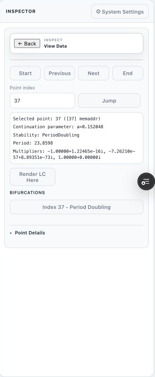

## 13. Compare the stable period-8 cycle with an orbit

1. Create `Period_8_Cycle` and **Branch: Period_8** from the third period doubling.

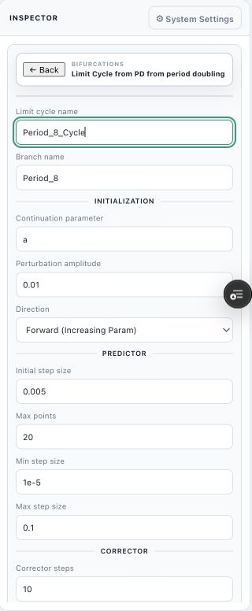

2. Apply the red branch color immediately.
3. Select **Branch: Period_8** and click **View Data**.
4. Go to **index 10**.
5. Confirm that **Stability** is **stable**.
6. Confirm that **a = 0.152889**.
7. Click **Render LC Here**.
8. Open the cycle **Data preview**.
9. Use row 0 as the initial state for `Orbit_Matched`:

$$
(x,y,z)=(4.9447,5.1508,1.8314).
$$

10. Set the orbit parameter **a** to **0.152889**.

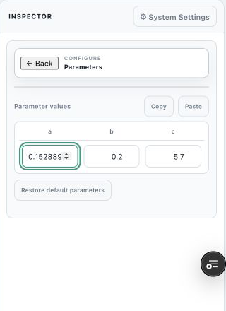

11. Run the orbit for a duration of **300** with a step size of **0.01**.
12. Hide `Period_4_Cycle`.
13. Keep `Period_8_Cycle` visible.
14. In `Scene_1`, replace the period-4 cycle source with `Period_8_Cycle`.
15. Use **Turntable rotation** to make the loops clear.

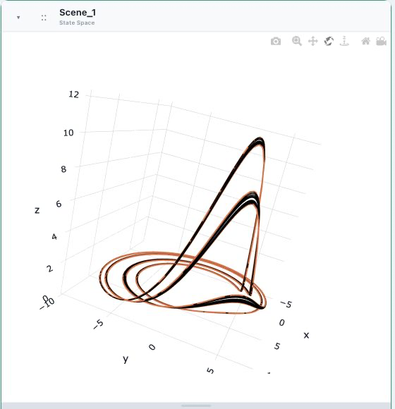

16. Expand `Event_Map_Minus_y`.

The period-8 cycle gives four orange return points for this event definition. The dark orbit follows the same four-point cobweb.

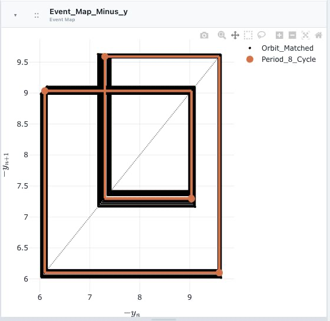

17. Return to **Branch: Period_8**.
18. Go to **index 14**.

Fork finds the fourth period doubling at

$$
a=0.154034.
$$

The period is approximately **47.6899**. Stop here. Do not create a period-16 branch in this tutorial.

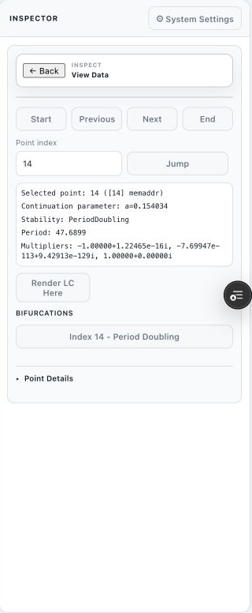

## 14. Check the complete result

Confirm these bifurcation values:

| Event | Branch | Index | Parameter **a** | Period |
| --- | --- | ---: | ---: | ---: |
| Hopf | `Equilibrium_a` | 3 | 0.00597844 | Not applicable |
| First period doubling | `Period_1` | 153 | 0.109639 | 6.04813 |
| Second period doubling | `Period_2` | 45 | 0.142997 | 11.9648 |
| Third period doubling | `Period_4` | 37 | 0.152048 | 23.8598 |
| Fourth period doubling | `Period_8` | 14 | 0.154034 | 47.6899 |

Complete this final inspection:

1. Expand `Bifurcation_a_vs_y`.
2. Confirm that **Abscissa** is **Parameter: a**.
3. Confirm that **Ordinate** is **State space variable: y**.
4. Select `Equilibrium_a`, `Period_1`, `Period_2`, `Period_4`, and `Period_8` under **Displayed branches**.
5. Confirm that the branch colors agree with the color plan.
6. Confirm that no duplicate object names or temporary systems are present.
7. In Objects, keep items that must be on top before the items that they cover.

The period-doubling values become closer as **a** increases. The last three gaps give the ratios

$$
\frac{0.142997-0.109639}{0.152048-0.142997}\approx3.69,
$$

and

$$
\frac{0.152048-0.142997}{0.154034-0.152048}\approx4.56.
$$

These early ratios move toward the Feigenbaum value of approximately 4.669. The values are not yet at the limiting value because this tutorial stops at the fourth period doubling.

## Result

You started with the irregular default Rössler orbit. You then calculated a stable equilibrium and followed it to a supercritical Hopf bifurcation. From that Hopf point, you followed stable limit cycles through four period doublings. The State Space Scene showed the full three-dimensional motion. The Event Map reduced each orbit to successive local maxima of $-y(t)$ and showed the repeated doubling in a cobweb plot.
